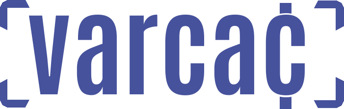

<p align="center">
  

</p>

**Incentive Compensation Management (ICM) engine; compute, track, and prove payouts with confidence.**

**VarCAC** is a local-first commissions platform for modern sales orgs. It pairs a clean, admin-friendly UI with a powerful JavaScript computation engine, so you can model *any* plan—from simple rate cards to multi-tier accelerators, SPIFFs, draws, manager roll-ups, without giving up control of your data.

---

## Why VarCAC
- 🔒 **Local-first & private by design** — run it on your own machine or network (Docker). Your data never leaves your environment.
- 🧠 **Real logic, real results** — a robust **JavaScript** engine drives calculations, letting you encode rules exactly as you pay. It's simpler and more precise than spreadsheet formuals.
- 🧩 **Flexible data sources & team structures** — bring your data as-is; include plans for reps, managers, stack-ups, or anything else you can imagine.
- ⏪ **Version everything** — export/import your entire dataset to *replay, compare, audit, backup, and restore* any period.
- 🤝 **Shareable** — between team-members that use VarCAC enabling collaboration without exposing your whole system.
- ✔ **Elegant & minimal** — simple to understand, sophisticated capabilities, fast to operate, with no heavy external dependencies.

---

## What you can do
- **Quota-based tiers & accelerators** by period or plan window.
- **SPIFFs/bonuses** - one-off or scheduled.
- **Draws / Clawbacks** - for those new reps, or poor performing reps.
- **Flexible*** manager / team roll-ups
- **Multi-plan assignments** per participant (AE + SE + stack-ups)
- **Comp Plan Statements** per participant: detailed comprehensive, auditable, traceable comp plan statements.

---

## How it works
1. **Post your data** into a flexible data source model.  
2. **Build your computations** to apply logic to your source data.
3. **Define your Comp Plans** with flexible payout periodicity. 
4. **Attach Computations** to a plan your plans (per-period or whole-window scope).  
3. **Run Comp Plan Calculations** → deterministic payout lines.
4. **Export/import** for backup/restore → results in packaged-up files for mobility.

---

## Architecture (some technicals)
- **Client:** Vue + Vite SPA
- **Server:** Express (Node 22+) serving API and static assets on **port 3001**
- **DB:** MariaDB (containerized).

---

## Quick start (Docker)
**Prereqs:** Docker Desktop (or Docker Engine + Compose).

```bash
# clone
git clone <your-repo-url> && cd <repo-root>

# bring up app (3001) + db (host 3007)
docker compose up -d

# open the VarCAC
http://localhost:3001
```
---

## License
[](LICENSE)

---

**VarCAC**: pay exactly how you plan - **locally, transparently, and repeatably**.
